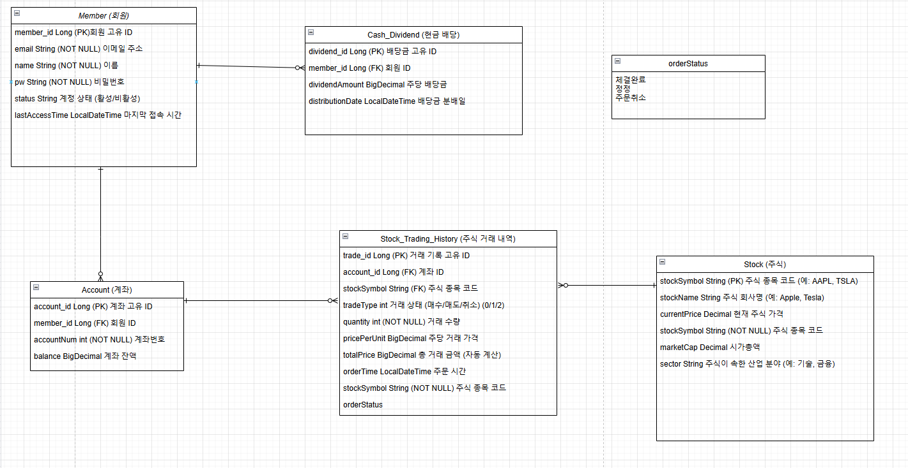

# 🚀 **프로젝트 목표**

- **📈 실시간 주식 트레이닝과 주식 매매를 도와주는 서비스**
- 성능과 유지보수성을 고려하여 **⚡ 효율적이고 확장 가능한 구조**로 개발
- **📚 이펙티브 자바**의 내용을 반영하여 코드 설계 및 품질 향상

---

## 💻 **Development Environment**

### **Frontend** 🌐

| 🛠️ Tool         | ⚙️ Version |
| --------------- | ---------- |
| **Thymeleaf**   | 3.3.5      |

### **Backend** 🔧

| 🛠️ Tool          | ⚙️ Version/Name         |
| ---------------- | ----------------------- |
| **JDK**         | 21                     |
| **IDE**         | IntelliJ IDEA          |
| **Framework**   | Spring Boot 3.4.0  |
| **Database**    | MySQL 8.4.3            |
| **ORM**         | Hibernate 6.5.3 Final  |

---

## 🌟 **Project Features (Planned)**

1. **🔍 실시간 시세 조회**
   - 주요 증권사 API(Kiwoom, Korea Investment 등)를 활용하여 실시간 주가 정보를 제공
2. **💰 주식 매매 기능**
   - 사용자 친화적인 인터페이스와 안정적인 매매 거래 지원
3. **📬 알림 기능**
   - 설정한 목표가에 도달 시 사용자에게 실시간 알림 제공
4. **⚙️ 성능 최적화 및 유지보수**
   - 확장 가능한 구조와 효율적인 트랜잭션 관리를 통해 고성능 환경 지원

##  **ERD**

- **Member**: 사용자 정보를 관리하는 테이블로, 이메일, 이름, 비밀번호, 상태 등을 포함합니다.
- **Account**: 각 사용자의 계좌 정보를 기록합니다. `member_id`와 연관되어 사용자의 계좌 정보를 연결합니다.
- **Stock_Trading_History**: 사용자가 거래한 주식의 내역을 저장하며, 거래 시각, 거래 수량, 주식 코드 등을 포함합니다.
- **Stock**: 주식 종목에 대한 정보를 관리합니다. 주식 종목 코드(`stockSymbol`)와 현재 가격을 저장합니다.
- **Cash_Dividend**: 사용자가 보유한 주식에 대한 배당금 정보를 관리합니다. `member_id`와 연관되어 사용자의 배당금을 기록합니다.
https://drive.google.com/file/d/1Ek02UnoSWtx_i3y5BP1eQld6z6vldD6t/view?usp=sharing